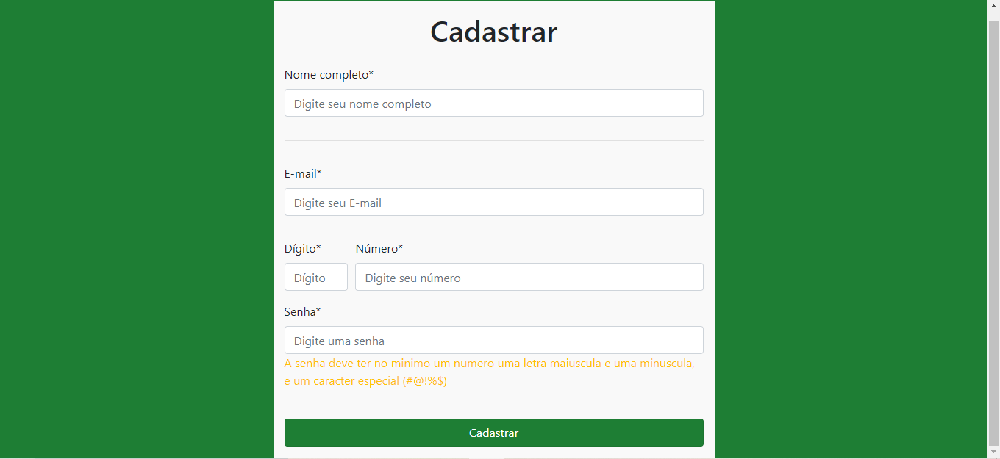

# Tela de cadastro

Uma tela de cadastro 

## Sobre o Projeto

Este projeto consiste em uma tela de cadastro usando JavaScript Puro

## Demonstração do projeto

Foto do projeto

Resultado final: https://compassionate-jepsen-1ea055.netlify.app/

## Objetivo do projeto

Projeto desenvolvido para treinar JavaScript

## Tecnologias Usadas no projeto

Projeto feito utilizando as seguintes linguagens/tecnologias: 

* HTML/CSS
* Bootstrap 4
* JavaScript Puro

## Instalação

Para que este projeto rode em sua máquina, siga os passos abaixo:

Clone este repositório em uma pasta em sua máquina  
$ git clone https://github.com/Leveditor/cadastro.git

Entre na pasta  
$ cd todoList

Entre na pasta  
$ cd cadastro  
